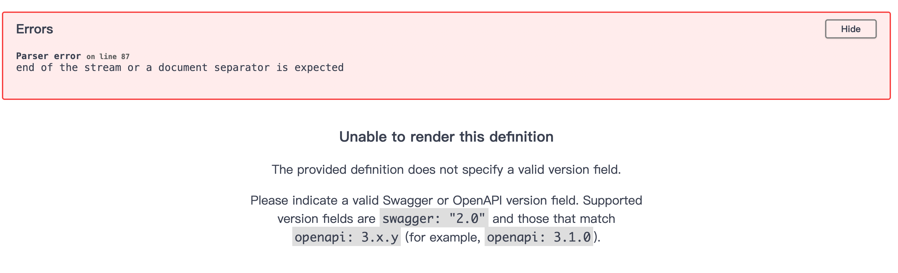

## 直接部署 paddlex

1. `docker pull ccr-2vdh3abv-pub.cnc.bj.baidubce.com/paddlex/paddlex:paddlex3.0.1-paddlepaddle3.0.0-cpu`
2. 创建容器并进如终端：第一个是 M1 芯片的 mac，第二个事 linux x86

   ```
     docker run -it --name paddlex-server \
       --platform linux/amd64 \
       -v $PWD:/paddle \
       --shm-size=8g \
       -p 5001:5001 \
       ccr-2vdh3abv-pub.cnc.bj.baidubce.com/paddlex/paddlex:paddlex3.0.1-paddlepaddle3.0.0-cpu \
       /bin/bash
   ```

   ```
     docker run -it --name paddlex-server \
       -v $PWD:/paddle \
       --shm-size=8g \
       -p 5001:5001 \
       ccr-2vdh3abv-pub.cnc.bj.baidubce.com/paddlex/paddlex:paddlex3.0.1-paddlepaddle3.0.0-cpu \
       /bin/bash
   ```

3. 在容器里面安装 API 服务包：`paddlex --install serving`
4. 安装依赖：`pip3 install "paddlex[ocr]==3.0.1"`
5. 启动服务：`paddlex --serve --pipeline OCR --port 5001`
6. 步骤 5 这种启动会导致结束进程，paddlex 服务就不在了。`docker exec -it 6d087391d28e /bin/bash -c "nohup paddlex --serve --pipeline OCR --host 0.0.0.0 --port 5001"`或有日志：`docker exec -it 6d087391d28e /bin/bash -c "nohup paddlex --serve --pipeline OCR --host 0.0.0.0 --port 5001 > serve.log 2>&1 &"` 6d087391d28e 是容器名字。
7. 测试接口:

   ```
   curl -X POST http://localhost:5001/ocr \
   -H "Content-Type: application/json" \
   -d '{
   "file": "https://imagev2.xmcdn.com/storages/ef1b-audiofreehighqps/A9/E5/GKwRIRwMIDZVAAAU8APGHO9Z.png",
   "fileType": 1,
   "useDocOrientationClassify": true,
   "useDocUnwarping": true,
   "useTextlineOrientation": true,
   "textDetLimitSideLen": 736,
   "textDetLimitType": "min",
   "textDetThresh": 0.4,
   "textDetBoxThresh": 0.5,
   "textDetUnclipRatio": 1.8,
   "textRecScoreThresh": 0.5
   }'
   ```

```
curl -X POST http://localhost:5001/ocr \
 -H "Content-Type: application/json" \
 -d '{
"file": "https://imagev2.xmcdn.com/storages/ef1b-audiofreehighqps/A9/E5/GKwRIRwMIDZVAAAU8APGHO9Z.png",
 "returnVisualize": false
}'

curl -X POST http://127.0.0.1:5001/ocr \
 -H "Content-Type: application/json" \
 -d '{
"file": "https://imagev2.xmcdn.com/storages/ef1b-audiofreehighqps/A9/E5/GKwRIRwMIDZVAAAU8APGHO9Z.png"
}'

curl -X POST https://www.qunyangbang.cn/ocr/ocr \
 -H "Content-Type: application/json" \
 -d '{
"file": "https://imagev2.xmcdn.com/storages/ef1b-audiofreehighqps/A9/E5/GKwRIRwMIDZVAAAU8APGHO9Z.png",
"hideOCRImage": true,
"b": 1
}'

curl -X 'GET' \
 'http://localhost:5001/health' \
 -H 'accept: application/json'

```

8. 修改下面两个文件，增加接口参数`hideOCRImage`，控制接口返回字段。(文件地址：`/var/lib/docker/overlay2/c625c7c4a365d03b3ddd293b65d01d572538b8e23bd8136ae9a54451af3cba81/merged/root/PaddleX`)
   `paddlex/inference/serving/basic_serving/_pipeline_apps/ocr.py`

   ```
            # 根据 hideOCRImage 字段决定是否包含所有图像字段
            result_dict = {"prunedResult": pruned_res}

            # 只有当 hideOCRImage 不为 True 时才包含所有图像字段
            if not request.hideOCRImage:
                result_dict["ocrImage"] = imgs.get("ocr_img")
                result_dict["docPreprocessingImage"] = imgs.get("doc_preprocessing_img")
                result_dict["inputImage"] = imgs.get("input_img")

            ocr_results.append(result_dict)

   ```

   `paddlex/inference/serving/schemas/ocr.py`:

   ```
    class InferRequest(ocr.BaseInferRequest):
        useDocOrientationClassify: Optional[bool] = None
        useDocUnwarping: Optional[bool] = None
        useTextlineOrientation: Optional[bool] = None
        textDetLimitSideLen: Optional[int] = None
        textDetLimitType: Optional[str] = None
        # Better to use "threshold"? Be consistent with the pipeline API though.
        textDetThresh: Optional[float] = None
        textDetBoxThresh: Optional[float] = None
        textDetUnclipRatio: Optional[float] = None
        textRecScoreThresh: Optional[float] = None
        hideOCRImage: Optional[bool] = None # 这行

   ```

### nginx 配置

主要是访问的时候增加/ocr 前缀，在 nginx 这里去掉

```
    location ^~ /ocr {
        rewrite ^/ocr/(.*)$ /$1 break;
        proxy_pass http://127.0.0.1:5001/;
    }

```

### 报错

1. 访问/docs 接口来看文档，报错：
   
   解决：降低 serving 版本，`pip install "paddlex[serving]==3.0.0"`

### 参考

1. paddlex 文档：https://paddlepaddle.github.io/PaddleX/latest/index.html
2. paddlex 本地安装：https://paddlepaddle.github.io/PaddleX/latest/installation/installation.html
3. PaddleX 服务化部署指南：https://paddlepaddle.github.io/PaddleX/latest/pipeline_deploy/serving.html
4. paddlepaddle 安装：https://www.paddlepaddle.org.cn/install/quick?docurl=/documentation/docs/zh/install/docker/macos-docker.html
5. PaddlePaddle docker 镜像安装：https://www.paddlepaddle.org.cn/documentation/docs/zh/install/docker/linux-docker.html#anchor-0
6. PaddleOCR 本地安装，本地开发：https://paddlepaddle.github.io/PaddleOCR/latest/version3.x/installation.html
7. PP-StructureV3 产线使用教程：https://paddlepaddle.github.io/PaddleOCR/latest/version3.x/pipeline_usage/PP-StructureV3.html
8. 单字坐标返回：https://github.com/PaddlePaddle/PaddleOCR/pull/10515
   - ` --return_word_box=True`参数

## 命令参考

1.  搭建 docker：https://cloud.tencent.com/document/product/213/46000#azYB6haoacR0zO9ry1cHx

    1. `sudo yum install docker -y`
    2. `sudo systemctl start docker`
    3. `sudo docker info`

2.  使用 docker 安装 paddleOCR：[参考 1](https://www.paddlepaddle.org.cn/documentation/docs/zh/install/docker/linux-docker.html#anchor-0);[参考 2](https://www.paddlepaddle.org.cn/install/quick?docurl=/documentation/docs/zh/install/docker/linux-docker.html)

    1. 拉取预安装 PaddlePaddle 的镜像：`docker pull ccr-2vdh3abv-pub.cnc.bj.baidubce.com/paddlepaddle/paddle:3.0.0`
    2. 用镜像构建并进入 Docker 容器：`docker run --name paddle -it -v $PWD:/paddle ccr-2vdh3abv-pub.cnc.bj.baidubce.com/paddlepaddle/paddle:3.0.0 /bin/bash`
       1. 第二次直接进入容器：`docker exec -it paddlex-server /bin/bash`
       2. 查看所有的容器：`docker ps -a`
       3. 查看所有镜像：`docker images`
       4. 停止容器运行：`docker stop paddle`
       5. 删除容器：`docker rm paddle`
       6. 删除镜像：`docker rmi a5d1b6184e99`
       7. 删除所有镜像：`docker rmi $(docker images -q)`
       8. 启动容器：` docker start paddle_server`
       9. 查看容器映射宿主机的路径：`docker inspect paddlex-server`
       10. 查看容器内的进程 id：`ps aux | grep "paddlex --serve"`
    3. 在容器中下载 PaddleOCR 源码：`git clone https://github.com/PaddlePaddle/PaddleOCR.git`或者 gitee 的仓库：`git clone https://gitee.com/paddlepaddle/PaddleOCR`
    4. 进入项目，切换指定分支：`cd PaddleOCR && git checkout release/3.0`
    5. 安装依赖：`pip3 install -r requirements.txt -i https://mirrors.tuna.tsinghua.edu.cn/pypi/web/simple`
    6. 设置清华源：`pip3 config set global.index-url https://mirrors.tuna.tsinghua.edu.cn/pypi/web/simple`
